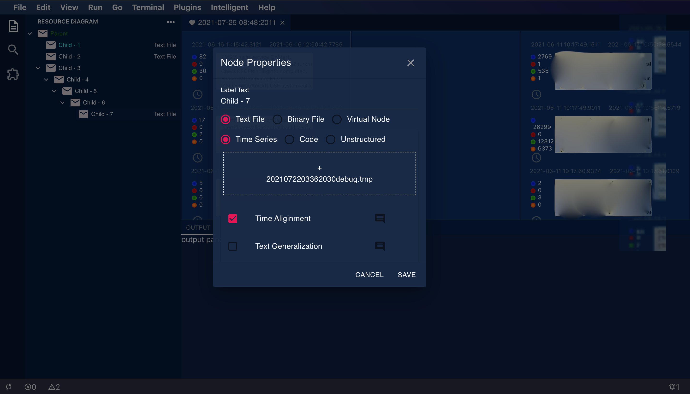

# 简介
仿 VScode 界面的日志挖掘工具。提供将混合的多个结构化序列数据转化成并行事件序列的流程图结构。
基于 React, reduxjs 1.6.0, material-ui, next.js 10.0.0.

# Snapshot





# Features
1. 支持多种序列资源类型。
2. 提供插件扩展，可选择性的将需要的插件组成计算管道。灵感来自 koa-compose。
3. 异步任务资源池。  -- TODO
4. *** 面向业务需求，提供可选的流程图生成类型：event scheduler workflow 三种计算类型  -- CURRENT
5. 日志和性能测量指标通知队列。  -- TODO 
6. 结构化时间序列数据流中的事件边界自学习（序列标注），事件共现分析，异常检测。  -- TODO
7. TypeScript 支持。  -- TODO 
8. 提供 keyword 快速并行查询。（需要进一步分析可行性）


# How to create a plugin
一个 plugin 是拥有如下文件的目录。
灵感来自 grafana extension。

```
manifest.json
module.js      
module.html
view_ctrl.js
```

### manifest.json
插件描述的元数据信息， 字段 id，name 是必须选项。
### module.js  
导出的计算模块，需要提供具有签名 ```(context: object, next: (void) => void) => void``` 的 ```handler```函数并作为 return 返回的对象成员。因为插件的动态加载机制是直接执行返回结果而不是类似 require 那样静态（尝试过这种方法，但是无法动态加载 JS 模块）基于 runInThisContent 执行的，所以导出的结果需要使用 return。当然也可以自己编写类似 CommonJS 那样的导出模块。

### module.html 
这是插件的组件文件的 DOM 文件，会在插件管理器中显示为自定义的配置控件。

### view_ctrl.js 
module.html 引用的 JS 文件。可以实现一些网页元素控件的交互逻辑。由于插件的独立性，因此实现插件可以使用任意前端技术框架。

### 预置 plugin
1. chunkify: 将结构化序列数据流划分为颗粒更大的区块。以便于上层UI展示。事件流程图依赖此插件。
2. genelizer:  可以将原始数据转换为词法上更泛化的数据。以便于之后处理。例如文本区块化依赖此插件。
3. syntax highlight: 语法高亮组件。

# Introduce to Node Tree 
