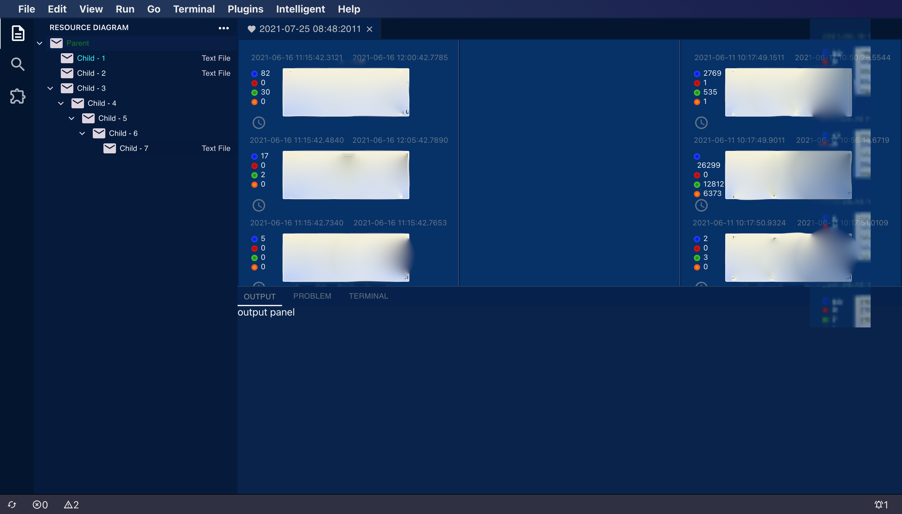

# 简介
日志分析工具，可以将混合日志流分析出多个干净的日志流。
# Features
1. 支持多种序列资源类型。
2. 提供插件扩展，可选择性的将需要的插件组成计算管道。提供插件的配置页面。
3. 基于 elasticsearch，提供 keyword 查询
4. 生成各资源文件的基于线程时序图。
5. 提供类VSCode的操作界面。
6. 支持多行日志格式。
7. 前后端为JS全栈开发。
8. [TODO]  TypeScript支持。 
9. [TODO]  状态查询。
10. [TODO]  命令面板功能富化。
11. [TODO]  事件边界自学习（识别出 event），事件共现分析（识别出 scheduler），异常检测, 预测 


# How to use
处理的日志格式，需要形如  

```
YYYY-MM-DD HH:mm:ss.msec level [threadID] [FunctionName] - [Message]

```  
匹配如下的正则格式   
```

/(\d{4}-\d{2}-\d{2} \d{2}:\d{2}:\d{2}\.\d{4}) (\w+) \[([^\]]+)\] (\w+) - (.*)$/
```
自定义正则格式，待添加。

# Snapshot





# How to create a plugin
一个 plugin 是拥有如下文件的目录。
灵感来自 grafana extension。

```
manifest.json
module.js      
module.html
view_ctrl.js
```

### manifest.json
插件描述的元数据信息， 字段 id，name 是必须选项。
### module.js  
导出的计算模块，需要提供具有签名 ```(context: object, next: (void) => void) => void``` 的 ```handler```函数并作为 return 返回的对象成员。因为插件的动态加载机制是直接执行返回结果而不是类似 require 那样静态（尝试过这种方法，但是无法动态加载 JS 模块）基于 runInThisContent 执行的，所以导出的结果需要使用 return。当然也可以自己编写类似 CommonJS 那样的导出模块。

### module.html 
这是插件的组件文件的外观配置文件，在插件管理器中通过选择插件后可显示。

### view_ctrl.js 
module.html 引用的 JS 文件。可以实现一些网页元素控件的交互逻辑。由于插件的独立性，因此实现插件可以使用任意前端技术框架。

### 预置 plugin
1. line formatter: 将原始日志文本行，转换为指定的数据结构。如果日志行有不一样的格式，就需要在这个插件里面修改。默认的格式化正则为  
```
/(\d{4}-\d{2}-\d{2} \d{2}:\d{2}:\d{2}\.\d{4}) (\w+) \[([^\]]+)\] (\w+) - (.*)$/;
```

2. syntax highlight: 语法高亮组件， 提供字符和HTML片段的映射。

# Introduce to Node Tree 
节点一共有三种根类型
1. 字符流文件
2. 二进制流文件
3. 虚拟节点

每种类型拥有不一样的解析方法，根据类型添加解析即可。

# deployment
1. docker run -d -p 9200:9200 -p 9300:9300 -e "discovery.type=single-node" docker.elastic.co/elasticsearch/elasticsearch:7.13.4
2. [TODO] docker 化部署
